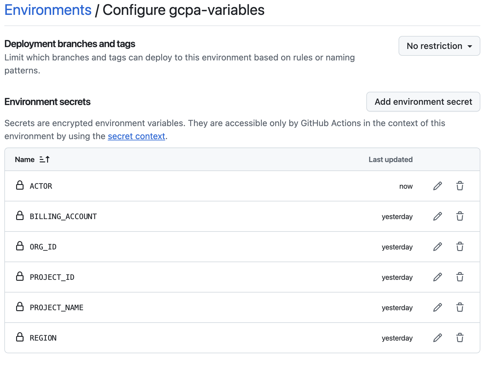
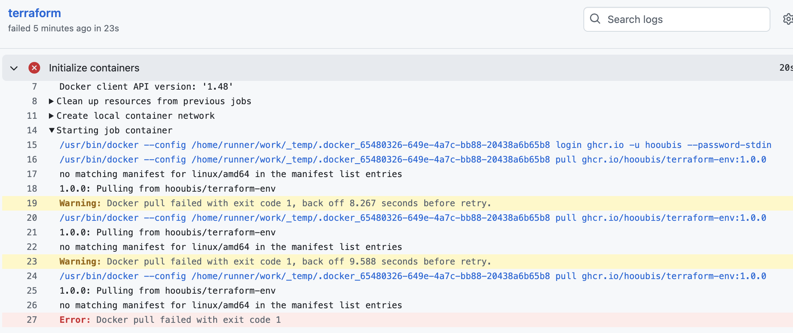

🧪 Step-by-Step: Build and Run Locally
1. Build the image locally
Make sure you're in the directory with your Dockerfile, then run:

bash
docker build -t terraform-env:dev .
This tags the image as terraform-env with a local dev tag.

2. Run the container interactively
To test it manually:

bash
docker run -it --rm terraform-env:dev bash
This opens a shell inside the container so you can verify Terraform is installed, check environment setup, etc.


'''
docker run -it --rm terraform-env:dev bash

Hooray! Oh My Zsh has been updated!

To keep up with the latest news and updates, follow us on X: @ohmyzsh
Want to get involved in the community? Join our Discord: Discord server
Get your Oh My Zsh swag at: Planet Argon Shop
➜  gcpa-data-engineering-certification 
➜  gcpa-data-engineering-certification git:(dev3) ✗ docker run -it --rm terraform-env:dev bash
root@121b4866df6e:/workspace# echo $HOSTNAME
121b4866df6e
root@121b4866df6e:/workspace#       
```


3. Run a Terraform command directly
If you just want to validate the install:

bash
docker run --rm terraform-env:dev terraform version
4. Mount your local Terraform config (optional)
To test with real .tf files:

bash
docker run -it --rm \
  -v "$(pwd)/your-terraform-dir":/workspace \
  -w /workspace \
  terraform-env:dev bash
This mounts your local directory into the container and sets it as the working directory.


# Push your image to GHCR
# 1) Login (create a PAT with "write:packages"; SSO-enable it if your org requires)
echo $GH_PAT | docker login ghcr.io -u <GITHUB_USERNAME> --password-stdin

```
➜  terraform-env git:(dev3) ✗ echo $GHCR_PAT | docker login ghcr.io --username hooubis --password-stdin
Login Succeeded
```

# 2) Build the image from your Dockerfile
docker build -t ghcr.io/<OWNER>/<IMAGE_NAME>:<TAG> .

# 3) Push it
docker push ghcr.io/<OWNER>/<IMAGE_NAME>:<TAG>

```
Login Succeeded
➜  terraform-env git:(dev3) ✗ docker logout ghcr.io 2>/dev/null || true                              
Removing login credentials for ghcr.io
➜  terraform-env git:(dev3) ✗ printf %s "$GHCR_PAT" | docker login ghcr.io -u hooubis --password-stdin
Login Succeeded
➜  terraform-env git:(dev3) ✗ IMG=ghcr.io/hooubis/terraform-env:1.0.0                                  
docker build . \
  -t "$IMG" \
  --label org.opencontainers.image.source="https://github.com/hooubis/terraform-env"
[+] Building 0.6s (10/10) FINISHED                                                                                                                    docker:desktop-linux
 => [internal] load build definition from Dockerfile                                                                                                                  0.0s
 => => transferring dockerfile: 817B                                                                                                                                  0.0s
 => [internal] load metadata for docker.io/library/ubuntu:22.04                                                                                                       0.5s
 => [internal] load .dockerignore                                                                                                                                     0.0s
 => => transferring context: 2B                                                                                                                                       0.0s
 => [1/6] FROM docker.io/library/ubuntu:22.04@sha256:4e0171b9275e12d375863f2b3ae9ce00a4c53ddda176bd55868df97ac6f21a6e                                                 0.0s
 => => resolve docker.io/library/ubuntu:22.04@sha256:4e0171b9275e12d375863f2b3ae9ce00a4c53ddda176bd55868df97ac6f21a6e                                                 0.0s
 => CACHED [2/6] RUN apt-get update && apt-get install -y     gnupg     software-properties-common     curl     unzip     ca-certificates     lsb-release             0.0s
 => CACHED [3/6] RUN curl -fsSL https://releases.hashicorp.com/terraform/1.6.6/terraform_1.6.6_linux_amd64.zip     -o terraform.zip &&     unzip terraform.zip &&     0.0s
 => CACHED [4/6] RUN terraform --version                                                                                                                              0.0s
 => CACHED [5/6] WORKDIR /workspace                                                                                                                                   0.0s
 => CACHED [6/6] RUN echo "SUCCESS!"                                                                                                                                  0.0s
 => exporting to image                                                                                                                                                0.0s
 => => exporting layers                                                                                                                                               0.0s
 => => exporting manifest sha256:384d7f48ecddb7fe92936151fac02550ac6ba71b774be4414e2f811d9d9cd03c                                                                     0.0s
 => => exporting config sha256:86b24beb5e3604826d7bfa323b14b1db058477396a20b2ccb327b4714d142660                                                                       0.0s
 => => exporting attestation manifest sha256:2aa12343cac5a2bd4707a86c19d73edf97afc7b06044c68d5ea50cd2f5ea6d65                                                         0.0s
 => => exporting manifest list sha256:0242436eeac855e18337fd68b819fefadac40c050ec7a2e3c16c0c84be46ecec                                                                0.0s
 => => naming to ghcr.io/hooubis/terraform-env:1.0.0                                                                                                                   0.0s
 => => unpacking to ghcr.io/hooubis/terraform-env:1.0.0                                                                                                                0.0s
➜  terraform-env git:(dev3) ✗ IMG=ghcr.io/hooubis/terraform-env:1.0.0
docker build . \
  -t "$IMG" \
  --label org.opencontainers.image.source="https://github.com/hooubis/terraform-env"
[+] Building 0.4s (10/10) FINISHED                                                                                                                    docker:desktop-linux
 => [internal] load build definition from Dockerfile                                                                                                                  0.0s
 => => transferring dockerfile: 817B                                                                                                                                  0.0s
 => [internal] load metadata for docker.io/library/ubuntu:22.04                                                                                                       0.3s
 => [internal] load .dockerignore                                                                                                                                     0.0s
 => => transferring context: 2B                                                                                                                                       0.0s
 => [1/6] FROM docker.io/library/ubuntu:22.04@sha256:4e0171b9275e12d375863f2b3ae9ce00a4c53ddda176bd55868df97ac6f21a6e                                                 0.0s
 => => resolve docker.io/library/ubuntu:22.04@sha256:4e0171b9275e12d375863f2b3ae9ce00a4c53ddda176bd55868df97ac6f21a6e                                                 0.0s
 => CACHED [2/6] RUN apt-get update && apt-get install -y     gnupg     software-properties-common     curl     unzip     ca-certificates     lsb-release             0.0s
 => CACHED [3/6] RUN curl -fsSL https://releases.hashicorp.com/terraform/1.6.6/terraform_1.6.6_linux_amd64.zip     -o terraform.zip &&     unzip terraform.zip &&     0.0s
 => CACHED [4/6] RUN terraform --version                                                                                                                              0.0s
 => CACHED [5/6] WORKDIR /workspace                                                                                                                                   0.0s
 => CACHED [6/6] RUN echo "SUCCESS!"                                                                                                                                  0.0s
 => exporting to image                                                                                                                                                0.0s
 => => exporting layers                                                                                                                                               0.0s
 => => exporting manifest sha256:c2c2e65dfe92ac1892da8e36821da2da63f195b05875f6d36afec2a2db5ce8b8                                                                     0.0s
 => => exporting config sha256:a59d4df1fd215fbadc599db24879e5bb5060d5df7fd503bdfde620ca6e05b1b9                                                                       0.0s
 => => exporting attestation manifest sha256:ac43abb6e49b228087ca4854e25e4c4e08f8b560f094747fe8f571b190ed9ab2                                                         0.0s
 => => exporting manifest list sha256:afcc8a43ed116fd9b5b42dbf2d65404acc5e4f503a5d3b5b0ebba78a3b08e9a7                                                                0.0s
 => => naming to ghcr.io/hooubis/terraform-env:1.0.0                                                                                                                  0.0s
 => => unpacking to ghcr.io/hooubis/terraform-env:1.0.0                                                                                                               0.0s
➜  terraform-env git:(dev3) ✗ docker push "$IMG"                                                      
The push refers to repository [ghcr.io/hooubis/terraform-env]
c209c8396e69: Pushed 
4f4fb700ef54: Pushed 
fdf67ba0bcdc: Pushed 
abf3d33048f2: Pushed 
a4c7e4728456: Pushed 
1fdce4b05c85: Pushed 
db895700c986: Pushed 
1.0.0: digest: sha256:afcc8a43ed116fd9b5b42dbf2d65404acc5e4f503a5d3b5b0ebba78a3b08e9a7 size: 856
➜  terraform-env git:(dev3) ✗ 
```

# github settings


>[!NOTE]
> user must have PAT setup in order to run docker push 

```
Quick example:

IMAGE=ghcr.io/<OWNER>/myapp:latest
docker build -t $IMAGE .
docker push $IMAGE

Optional: via GitHub Actions
name: Build & Push to GHCR
on: { push: { branches: [ "main" ] } }
permissions: { contents: read, packages: write }
jobs:
  build:
    runs-on: ubuntu-latest
    steps:
      - uses: actions/checkout@v4
      - uses: docker/login-action@v3
        with:
          registry: ghcr.io
          username: ${{ github.actor }}
          password: ${{ secrets.GITHUB_TOKEN }}
      - uses: docker/build-push-action@v6
        with:
          context: .
          push: true
          tags: ghcr.io/${{ github.repository_owner }}/myapp:latest
```

If you literally wanted github.io: GitHub Pages hosts static files only. You’d build your site (optionally with Docker), then publish the static output to Pages—not the container image.


# known issues
1. Arch from Mac builds are different from default Arch supplied by aws `ubuntu-latest`.
the workaround is to create a new image for amd64 vs (arm64-mac standard)  



```
# login first
printf %s "$CR_PAT" | docker login ghcr.io -u <owner> --password-stdin

# enable buildx (one-time)
docker buildx create --use

# build & push for both amd64 and arm64
docker buildx build \
  --platform linux/amd64,linux/arm64 \
  -t ghcr.io/<owner>/terraform-env:1.0.0 \
  -t ghcr.io/<owner>/terraform-env:latest \
  --push .
  ```